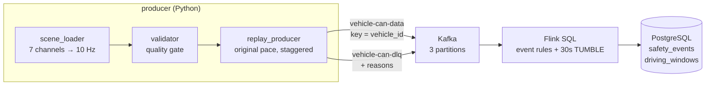

# nuScenes Driving Safety Pipeline

Real-time driving-safety analysis over **real autonomous-vehicle CAN bus data** — 979 driving
scenes recorded by Motional's Renault Zoe AV fleet ([nuScenes CAN bus expansion](https://www.nuscenes.org/nuscenes#canbus)).

The four CAN channels that carry driving dynamics — sampled anywhere between **2 Hz and 950 Hz** —
are unified onto a common 10 Hz stream, validated, replayed into Kafka at their original pace, and
analysed by Flink SQL — both event-level rules and 30-second tumbling windows — with results
landing in PostgreSQL.

> 실제 자율주행 차량에서 수집한 nuScenes CAN 버스 데이터 기반 실시간 주행 안전성 분석 파이프라인.
> 2Hz~950Hz로 주파수가 제각각인 CAN 채널을 10Hz로 통합·검증한 뒤 Kafka로 재생하고, Flink SQL로 급제동·
> 급선회·페달 오조작을 탐지하며 30초 윈도우로 난폭운전 패턴까지 집계합니다.

| Scenes | Records validated | Quarantined to DLQ | Sample rates unified | Detection verified |
|:--:|:--:|:--:|:--:|:--:|
| **979** | **191,089** | **207** (0.108%) | **2 Hz–950 Hz → 10 Hz** | **10 / 10** expected events |

## What the real data broke

Synthetic data never disagrees with itself. Real sensors drift apart, drop out, and arrive at
different rates — and every problem below surfaced only because the input is a recording of an
actual vehicle on a public road. Each was traced to a root cause and fixed:

| Symptom | Evidence | Root cause | Fix |
|---|---|---|---|
| **15 records flagged as sensor faults** | every one of the 15 occurred while accelerating or braking | the 2 Hz dashboard reading is forward-filled and can be 500 ms stale, while wheel rpm is current — during a speed change the two disagree *legitimately* | tolerance now includes the physics: `speed × 35% + abs(accel) × 0.5 s` → **15 false positives → 0**, no true positive lost |
| **A defect in the dataset itself** | 199 records from one scene | `scene-0419` ships with an **empty** `vehicle_monitor` channel | loader returns null instead of crashing; validator quarantines the scene to the DLQ with reasons |
| **Windowed results never appeared** while event rules were perfect | watermark frozen at `15:14:12`; the window needed `15:14:30` | replay started all scenes at the same instant, so the stream spanned **20 s — shorter than the 30 s window**, which therefore could never be passed | staggered scene starts (what a real fleet looks like) widened the stream to **~100 s**; the stuck window was released too |
| **Flink job died at startup** | `0` of `2` INSERT statements recognised | statements were classified by their first keyword, but a threshold-documenting comment precedes every INSERT | leading comment lines are skipped before classification — documentation can no longer break execution |

The same parsing bug existed in this project's [predecessor](#prior-version) and was backported there.

## Architecture



## The data

Each scene is roughly 20 seconds of driving, recorded as one JSON file per channel. Every record
carries a `utime` microsecond timestamp, so the channels can be re-aligned onto a shared clock.

| Channel | Rate | What it is | Fields used |
|---|---|---|---|
| `vehicle_monitor` | 2 Hz | dashboard summary | `vehicle_speed`, `yaw_rate`, `brake`, `throttle` |
| `ms_imu` | 100 Hz | inertial measurement | `linear_accel` (longitudinal / lateral) |
| `zoe_veh_info` | 100 Hz | vehicle CAN detail | four wheel speeds, `steer_corrected` |
| `zoesensors` | ~950 Hz | raw pedal sensors | `brake_sensor`, `throttle_sensor` |

**Resampling to 10 Hz.** Slow channels are *forward-filled* (a 2 Hz dashboard value stays valid
until the next one arrives); fast channels are *aggregated per 100 ms bin*. Averaging alone would
erase the very events we are looking for — a single −8 m/s² spike inside a bin disappears into the
mean — so each bin also keeps its extremes (`accel_lon_min`, `accel_lat_max`). Downsampling is
lossy by definition; the originals stay on disk, so anything faster than 100 ms remains
reprocessable rather than lost.

## Data-quality gate

The validator rejects only what is **physically impossible** — a speed no Renault Zoe can reach,
an acceleration beyond tyre-friction limits — and lets through everything that is merely
*dangerous*, because deciding whether hard braking is real is the detector's job, not the
validator's. Rejected records are not dropped: they go to a dead-letter topic with their reasons
attached, so nothing disappears silently and the DLQ arrival rate doubles as a health signal.

| Check | Rule |
|---|---|
| Range | speed outside 0–200 km/h; \|accel\| > 15 m/s² (1.5 G); \|yaw rate\| > 120 °/s |
| Completeness | required fields missing or null |
| Cross-channel | dashboard speed vs. mean wheel rpm disagree beyond tolerance |
| Ordering | event time moving backwards |

**Full-dataset sweep:** 191,089 records clean, 207 to DLQ (**0.108%**). Of those, 199 come from a
single scene — `scene-0419`, whose `vehicle_monitor` channel is **empty in the dataset itself**.
The remaining 8 are isolated cross-channel mismatches kept in the DLQ for inspection.

The cross-channel check needed one correction that is worth recording. It initially flagged 15
records as sensor faults; all 15 turned out to be *accelerating or braking*. The dashboard value is
2 Hz and forward-filled, so it can be up to 500 ms stale while the wheel reading is current —
during a speed change the two channels disagree legitimately. The tolerance now includes that
physics: `speed × 35% + |accel| × 0.5 s`. All 15 false positives disappeared, and no true positive
was lost.

## Detection rules

Thresholds are quoted from vehicle specifications and tyre-friction limits rather than invented,
then measured against all 979 scenes so their selectivity is known before deployment.

| Rule | Condition | Rationale | Fires on |
|---|---|---|---|
| `HARSH_BRAKE` | `accel_lon_min < −4.0 m/s²` and speed > 10 km/h | comfortable braking sits near 2.5 m/s²; 4 m/s² (0.4 G) is a genuine hard stop | 85 records |
| `SHARP_TURN` | `abs(accel_lat_max) > 3.0 m/s²` and speed > 10 km/h | lateral acceleration already encodes speed × curvature, so it is a better signal than steering angle alone | 168 records |
| `PEDAL_MISUSE` | brake applied while throttle > 50% | simultaneous brake and throttle indicates misapplication or a control fault | 30 records |
| `AGGRESSIVE_DRIVING` | ≥ 3 harsh events within a 30 s tumbling window, per vehicle | one hard brake may be evasive; three in 30 seconds is a driving pattern | window-level |

The speed guards exclude parking-lot manoeuvres, where large steering angles and small
decelerations are normal.

## Verified run

Expected event counts were computed independently from the scene files, then compared against
what the running pipeline actually wrote to PostgreSQL.

| | Expected | In PostgreSQL |
|---|---|---|
| `HARSH_BRAKE` | 2 | 2 |
| `PEDAL_MISUSE` | 5 | 5 |
| `SHARP_TURN` | 3 | 3 |

15 scenes, 2,905 records, replayed with staggered start times.

The windowed aggregation flagged `scene-0308`, whose three sharp turns fall inside one 30-second
window, as `AGGRESSIVE_DRIVING`. Two window rows were written rather than one: the second was a
window left open by an earlier replay, released once the advancing watermark finally passed its
end — see the engineering note below.

## Running it

Requires Docker, Python 3.9+, and the
[nuScenes CAN bus expansion](https://www.nuscenes.org/nuscenes#canbus) (free account, `can_bus.zip`;
the dataset is not redistributed here). Java and Maven are not needed — the Flink job is built
inside a container.

```bash
export NUSCENES_CAN_DIR=/path/to/can_bus        # defaults to ~/Downloads/can_bus/can_bus
pip install -r requirements.txt

python3 flink/job.py                            # build the jar, start the cluster, create topics
python3 producer/replay_producer.py --count 15 --speed 15
```

Flink UI: http://localhost:8081 · Results:

```bash
docker compose exec postgres psql -U flinkuser -d vehicle_db \
  -c "SELECT event_type, count(*) FROM safety_events GROUP BY 1;" \
  -c "SELECT * FROM driving_windows;"
```

The three producer modules below need **no third-party packages at all** — only the standard
library — so the ingestion and validation stages can be inspected before any infrastructure is
started:

```bash
python3 producer/scene_loader.py scene-0001     # inspect the unified 10 Hz records
python3 producer/validator.py scene-0001        # inspect what the quality gate rejects
python3 producer/replay_producer.py scene-0001 --dry-run
```

## Engineering notes

**Windows that never closed.** Event rules produced exactly the expected rows while the windowed
aggregation stayed empty. The Flink watermark was frozen at `15:14:12`; the window needed
`15:14:30` to close. Reading the last record of each Kafka partition explained the freeze — two
partitions had advanced to `15:15:08` while a third still sat at `15:14:17`, and a watermark is the
*minimum* across partitions, so the quietest partition was holding the clock. The underlying cause
was upstream of Flink entirely: the replay started every scene at the same instant, so the whole
stream spanned only ~20 seconds of event time — shorter than the 30-second window, which therefore
could never be passed. Staggering scene start times (which is also what a real fleet looks like)
widened the stream to ~100 seconds and the windows closed, including the one that had been stuck.
A window closes when the watermark passes its *end*, and the watermark only reaches
`last record − grace`; events near the end of a finite stream are therefore never windowed. In a
continuously flowing production stream that boundary never arrives.

**Comments that hid the SQL.** The job wrapper classified each statement by its first keyword, but
every `INSERT` is preceded by the comment block documenting its thresholds, so no INSERT was ever
recognised and the job died at startup. Documentation should not be able to break execution;
leading comment lines are now skipped before classification.

**Container names that collide.** Fixing service container names makes a compose project
unable to coexist with any other project using the same names. Removing them lets Compose namespace
containers per project.

## Roadmap

- [x] Phase 1 — unified multi-rate ingestion, quality gate with DLQ, safety rules, verified run
- [ ] Phase 2 — checkpointing and exactly-once, deliberate failure-recovery experiments, cloud deployment, throughput and latency benchmarks
- [ ] Phase 3 — lakehouse sink for full-resolution reprocessing, partition scaling and backpressure study

## Prior version

[vehicle-streaming-anomaly-detection](https://github.com/dlwogud/vehicle-streaming-anomaly-detection)
built the same streaming core on *simulated* engine-vehicle telemetry with a dbt/Airflow analytics
layer. This project is a redesign around real EV sensor data: a replay producer instead of a random
generator, safety rules derived from vehicle dynamics instead of engine thresholds, and an explicit
data-quality stage that simulated data never needed.
